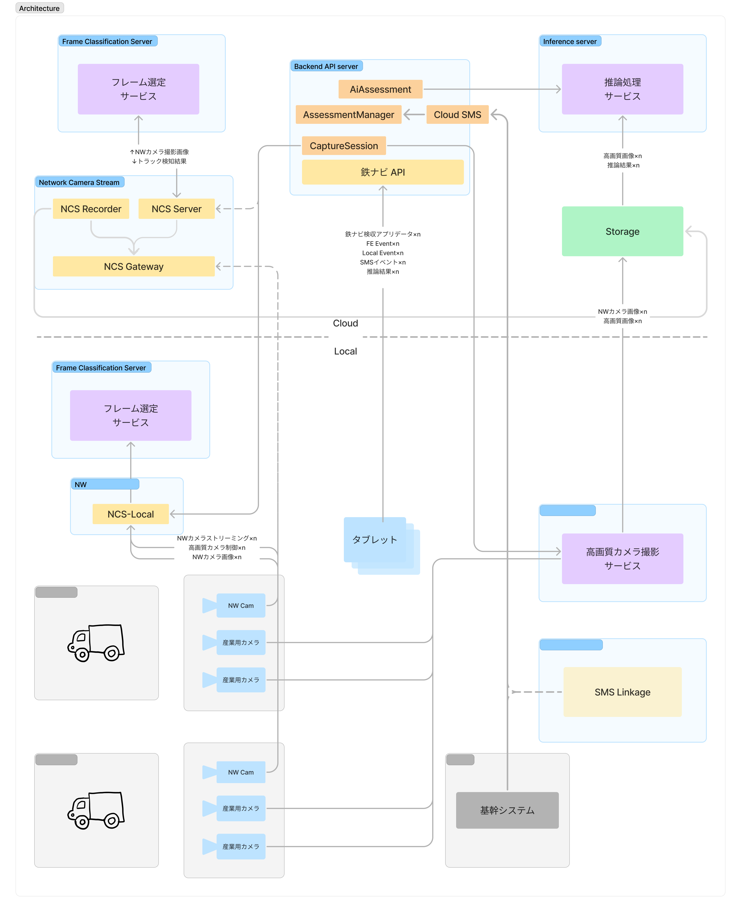

## はじめに

こんにちは、EVERSTEEL株式会社でエンジニアをしている片桐です。

弊社では鉄スクラップの画像解析を行う「鉄ナビ検収」というプロダクトを開発しており、鉄リサイクルの効率化・品質向上を目指しています。東大発のスタートアップとして、技術的なチャレンジを重視しながらプロダクト開発を進めています。

この記事では、鉄ナビ検収のバックエンドアーキテクチャについて紹介します。特に以下の内容について解説します：

- 鉄ナビ検収というプロダクトの概要と技術的背景
- TypeScript + Nest.jsを選択した理由と背景
- 関数型プログラミングのエッセンスを取り入れた実践例
- システム全体のアーキテクチャ構成とモジュール設計

スタートアップでのバックエンド開発や、関数型プログラミングの実践的な活用に興味のある方に、EVERSTEELでの開発現場の現状・雰囲気を感じてもらえればと思います。

## 鉄ナビ検収とは

鉄ナビ検収は、鉄スクラップの画像解析を通じて鉄リサイクル業界の効率化・品質向上を目指すプロダクトです。

### プロダクトの背景

鉄リサイクル業界では、持ち込まれた鉄スクラップの品質判定が重要な工程となっています。従来は人の目による判定が中心でしたが、判定者の経験や知識に依存する部分が多く、品質のばらつきや判定時間の課題がありました。

鉄ナビ検収では、AI技術を活用して鉄スクラップの画像から品質を自動で判定することで、これらの課題解決を図っています。

### なぜバックエンドアーキテクチャが重要なのか

鉄ナビ検収のバックエンドは、様々なシステムとの連携が求められる複雑な役割を担っています：

- **カメラシステムとの連携**: 鉄スクラップを撮影するカメラからの画像データを効率的に受信・処理
- **AI解析システムとの連携**: 画像をAIモデルに送信し、解析結果を適切に処理
- **工場基幹システムとの連携**: 各工場で異なる既存の基幹システムとのデータ連携
- **リアルタイム処理**: 判定結果を即座にフロントエンドや外部システムに提供

これらの多様な連携を安定して処理しながら、データの整合性を保ち、システム全体のスケーラビリティを確保することが、バックエンドアーキテクチャ設計の重要な課題となっています。

## 技術スタックの選択理由

鉄ナビ検収のバックエンドでは、**TypeScript** + **Nest.js** をメインの技術スタックとして採用しています。この組み合わせを選択した理由と背景について説明します。

### TypeScript採用の理由

TypeScriptを選択した主な理由は以下の通りです：

**チームの学習曲線を考慮した選択**
スタートアップという環境で、様々な経験レベルのメンバーが参加する中、TypeScriptの段階的な学習しやすさと、型システムによる開発支援が重要な要因でした。

**型安全性の確保**
複数のシステム間でやり取りされるデータの型を静的に検証することで、実行時エラーを防止できます。特に画像データやAI解析結果など、複雑なデータ構造を扱う際に効果的です。

**開発効率とメンテナンス性**
IDEの強力な補完機能により、API仕様やデータ構造を理解しやすく、チーム全体の開発速度向上に寄与します。また、リファクタリング時の安全性も高まります。

**エコシステムの活用**
Node.jsの豊富なライブラリエコシステムと、フロントエンドとの技術スタック統一により、チーム間での知見共有や効率的な開発が可能になります。

### Nest.js選択の背景

Nest.jsを採用した理由は以下の通りです：

**複雑なシステム連携への対応**
依存性注入により、外部システム（基幹システム、AI解析システム、カメラシステム）との連携部分を疎結合に保ち、テストしやすく変更に強い設計を実現できます。

**標準的な機能の迅速な実装**
データベースORM、認証、バリデーション、テストなど、必要な機能が標準で提供されており、ビジネスロジックに集中できます。

**構造化されたアプローチ**
モジュール分割やデコレータベースの設計により、チーム開発での一貫性を保ちながら、保守しやすいコードベースを構築できます。

### 関数型プログラミングのエッセンスを取り入れた理由

オブジェクト指向のNest.jsフレームワーク上で、関数型プログラミングの考え方を取り入れている理由は、複雑なシステム連携を伴う鉄ナビ検収において、コードの予測可能性とテスタビリティを重視しているためです。

**実際の課題から生まれた選択**
AI解析結果の処理や外部システムとのデータ変換など、エラーが発生しやすい処理が多く、従来のtry-catchベースのエラーハンドリングでは見落としが発生していました。Result型などの明示的なエラーハンドリングにより、この問題の改善を図っています。

これらの技術選択により、複雑なシステム連携を伴う鉄ナビ検収のバックエンドの安定性と保守性の向上を図っています。

## 関数型プログラミングの実践

前章で述べた通り、鉄ナビ検収では関数型プログラミングのエッセンスを取り入れています。ここでは、具体的にどのような技術要素を使って実践しているかを紹介します。

### Branded-Typeによる型安全性の向上

Branded-Typeは、TypeScriptで同じプリミティブ型でも異なる意味を持つ値を区別するための手法です。これにより、異なる意味を持つIDを誤って混同することを防げます。

鉄ナビ検収では、画像データのIDや解析結果のIDなど、多くの識別子を扱うため、この手法が特に効果的と考えています。具体的な実装例については、後述の「ドメインモデルの型安全性」で詳しく紹介します。

### neverthrowによるエラーハンドリング

neverthrowライブラリの`Result`型と`ResultAsync`型を使用して、関数型的なエラーハンドリングを実現しています。

**従来のtry-catch vs Result型**

```typescript
// 従来のアプローチ
async function processImage(imageId: string): Promise<AnalysisResult> {
  try {
    const image = await fetchImage(imageId);
    const result = await analyzeImage(image);
    return result;
  } catch (error) {
    // エラーハンドリングが分散しがち
    throw error;
  }
}

// Result型を使ったアプローチ
async function processImage(imageId: ImageId): Promise<Result<AnalysisResult, ProcessingError>> {
  return fetchImage(imageId)
    .andThen(analyzeImage)
    .mapErr(error => new ProcessingError(error.message));
}
```

**期待している効果**
- エラーが型として表現されるため、呼び出し側でエラーハンドリングが強制される
- エラーの種類が明確になり、適切な処理を行いやすい
- 非同期処理のチェインが読みやすくなる

### 独自のWorkflow実装

neverthrowの`ResultAsync`チェインでは深いネストが発生し、可読性とメンテナンス性が低下していました。この課題を解決するため、独自の「Workflow」DSLを実装し、試行錯誤を重ねています。

**注意**: 以下のコード例は、記事の理解を助けるために実際の実装を大幅に簡略化したものです。エラーハンドリング、型定義の詳細、内部実装などは省略しています。

**解決したい課題**
```typescript
// 深いネスト構造の問題
return parseInput(input)
  .andThen(validated => 
    fetchUser(validated)
      .andThen(user =>
        processUser(user)
          .andThen(result =>
            validateResult(result)
              .andThen(finalResult => ...)
          )
      )
  );
```

**Workflowによる改善**
```typescript
// フラットで読みやすい記述
const userProcessingWorkflow = Workflow
  .init<Input>()
  .chain(parseInput)
  .chain(fetchUser)
  .chain(processUser)
  .chain(validateResult);

const result = await userProcessingWorkflow.run(input, context);
```

**現在の活用場面**
- APIエンドポイントの処理フロー
- データ変換パイプライン
- 複数段階のバリデーション処理

**現在の実用性について**

正直なところ、この独自実装は現在も実験的な段階にあり、本格的な実用には課題が多い状況です。特に以下の点で実用に耐えない部分があります：

1. **型システムの複雑性**
   - 交差型（`O & WO`）の累積により、大規模なワークフローで型推論が困難
   - IDEでの型表示が読みにくい
   - キー名の衝突を検出できない

2. **状態管理の課題**
   - 各ステップの出力が累積し続ける
   - 不要なデータも保持され続ける
   - メモリ効率に課題がある可能性

3. **デバッグの困難さ**
   - どのステップでエラーが発生したか特定が困難
   - 実行時の中間状態が見えない
   - パフォーマンス測定の仕組みが不足

4. **実装の未完成部分**
   - エラーハンドリングの初期化方法が不明確
   - デバッグ情報の出力方法が限定的

**技術的なトレードオフ**

- **型安全性 vs 簡潔性**: 型の複雑さを許容して安全性を優先
- **機能性 vs 保守性**: 機能を絞って保守しやすさを重視  
- **パフォーマンス vs 可読性**: 実行効率より開発効率を優先

**現在の活用場面と今後の方向性**

限定的ではありますが、以下の場面で試験的に活用しています：
- 小規模なAPIエンドポイントの処理フロー
- 単純なデータ変換パイプライン
- 複数段階のバリデーション処理

チーム内では、この独自実装の改善（エラーハンドリングの完成、デバッグ情報の強化など）と並行して、より成熟したEffect-TSなどの既存ライブラリへの移行も含めて検討を進めています。実用性と学習コストのバランスを見極めながら、最適な解決策を模索している段階です。

### 開発体験への影響

これらの関数型的アプローチを試すことで、以下のような体験を得ています：

**デバッグ時の体験**
- 各関数の入力と出力が明確で、問題の特定がしやすい
- Result型により、エラーの発生箇所と原因の追跡がやりやすい

**テスト作成時の体験**
- 純粋関数中心の設計により、単体テストが書きやすい
- モックを作成する箇所が明確

**チーム開発での体験**
- 型により契約が明確になり、インターフェースが安定
- エラーハンドリングの漏れが型レベルで検出される

関数型プログラミングには学習コストがありますが、複雑なドメインロジックを扱う鉄ナビ検収において、一定の効果を感じています。

## アーキテクチャの詳細

前章で紹介した技術要素を、実際のシステムアーキテクチャの中でどのように活用しているかを説明します。

### システム構成の概要

鉄ナビ検収のバックエンドは、以下の4つの主要コンポーネントで構成されています：



**cloud_sms**
工場ごとに異なる基幹システムとの連携をサポートします。異なるJSON Schemaを用いた変換ロジックを担い、様々な基幹システムの実装に対応できる柔軟性を提供しています。

**assessment_manager**
基幹システムからの検収情報を処理します。検収データの受信、バリデーション、正規化を行い、後続の処理に必要な形式に整えます。

**capture_session**
検収情報とユーザからの操作を元に、撮影ループを処理します。カメラとの連携やフレームの管理、撮影タイミングの制御を担当します。

**ai_assessment**
撮影ループで解析対象と判定されたフレームのAI解析を実施します。AI解析システムとの連携から結果の処理まで、一連のAI処理フローを管理します。

なお、以前はCloud側に存在していたNCSやFrameClassificationといった機能は、現在工場ローカルでの処理に移行しており、レスポンス性能の向上を図っています。

### クリーンアーキテクチャの採用

鉄ナビ検収では、伝統的なクリーンアーキテクチャを参考にした4層構造を採用しています。

**現在のディレクトリ構造**
```
src/
  ai_assessment/
    application/      # UseCase層
    domain/          # Entity・ビジネスルール層
    infrastructure/  # 外部システム連携層
    presentation/    # API・Controller層
  assessment_manager/
    application/
    domain/
    infrastructure/
    presentation/
  ...
```

各層の責任は以下のように分離されています：

- **Domain層**: ビジネスルールとドメインエンティティ
- **Application層**: ユースケースの実行とドメインサービスの協調
- **Infrastructure層**: データベースや外部APIとの連携
- **Presentation層**: HTTPリクエスト/レスポンスの処理

この構造により、ビジネスロジックを外部の技術的関心事から分離し、テストしやすく保守性の高い設計を実現しています。

### ドメインモデルの型安全性

**Branded-Typeによる意味のある型定義**

ドメイン層では、Branded-Typeを活用して意味を持った型を定義しています：

```typescript
// Branded型の基本定義
declare const __brand: unique symbol;
type Brand<B> = { readonly [__brand]: B };
export type Branded<T, B> = T & Brand<B>;

// 検収IDの型定義
export type AssessmentId = Branded<string, 'AssessmentId'>;
const AssessmentId = (value: string): AssessmentId => value as AssessmentId;

// 安全なパーサー関数
export const parseAssessmentId = (
    value: string,
): Result<AssessmentId, Error> =>
    typeof value === 'string' && value.length > 0
        ? ok(AssessmentId(value))
        : err(new Error('AssessmentId is string and not empty'));
```

**安全なエンティティ作成**

エンティティの作成時には、複数のバリデーションを組み合わせて安全にオブジェクトを構築しています：

```typescript
export const parseAssessmentEntity = (
    props: AssessmentEntityParserProps,
): Result<AssessmentEntity, Error> =>
    Result.combine([
        parseAssessmentId(props.id),
        // 他のプロパティのパーサー
    ]).map(([id, /* ...otherProps */]) => ({ 
        id, 
        /* ...otherProps */ 
    }));
```

このアプローチにより、ドメインオブジェクトの整合性を型レベルで保証し、実行時エラーの削減を図っています。

### フレームワークとビジネスロジックの分離

Nest.jsのフレームワーク機能（依存性注入、デコレータなど）を活用しながらも、コアなビジネスロジックはフレームワークに依存しない形で実装しています。

```typescript
@Injectable()
export class StartAiAssessmentUsecase {
    constructor(
        @Inject(AI_ASSESSMENT_REPOSITORY)
        private readonly repository: AiAssessmentRepository,
        // 他の依存関係
    ) {}

    exec(args: Args) {
        // フレームワークから独立したビジネスロジックを呼び出し
        return businessLogic(this.repository)(args);
    }
}
```

この設計により、フレームワークの恩恵を受けながらも、ビジネスロジックのテスタビリティと再利用性の確保を目指しています。

### 将来への展望

現在、チーム内でディレクトリ構造の改善について議論を重ねています：

```
src/
  presentation/     # 統合されたAPI層
    auth
    control
    admin
    cloud_sms
  domain/          # ドメイン別の分離
    ai_assessment/
      application/
      domain/
      infrastructure/
    assessment_manager/
```

この構造により、プレゼンテーション層を統合し、各ドメインのビジネスロジックをより明確に分離することを目指しています。

複雑なドメインを扱う鉄ナビ検収において、クリーンアーキテクチャの原則と関数型プログラミングの要素を組み合わせることで、保守性と拡張性の両立を目指しています。特に、型安全性を重視したアプローチにより、チーム開発での品質向上を図っています。
